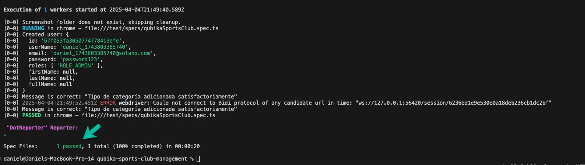

## 🏋️‍♂️ Qubika Sports Club - End-to-End Automation Test Suite
This project automates a complete end-to-end (E2E) workflow for the Qubika Sports Club Management System, integrating both API and UI validations in a single test flow.

## 📌 Tech Stack
Automation Framework: WebDriverIO

Language: TypeScript / JavaScript

API Client: Axios (or any other HTTP client)

Assertions: Chai / WebDriverIO expect

Test Runner: WDIO Test Runner

Package Manager: npm / yarn

## ✅ Why WebDriverIO?
I chose WebDriverIO because it offers seamless integration between API and UI testing within the same test file. Its modern syntax, async support, and wide ecosystem make it a great choice for building reliable and scalable end-to-end tests.

## 🧪 Automated Workflow
This test suite performs the following steps:

1. Create a new user via API

2. A POST request is made to the user endpoint (as documented in the Swagger API).

3. The user data is stored and reused for UI testing.

4. Navigate to the login page

5. The login UI is validated (fields are visible).

6. Log in with the created user

7. The credentials from the API step are used to log in through the UI.

8. Validate successful login

9. Verifies that the user lands on the dashboard or home page.

10. Access the Categories page

11. Navigates through the UI to the Category Management section.

12. Create a new category

13. Submits the category form and checks that the new category appears in the list.

14. Create a subcategory

15. Adds a subcategory under the previously created category and validates its presence.

## 🚀 How to Run This Project
1. Clone the Repository
2. Install pre-requisites
- NodeJs installed:
```
//Mac installation (Homebrew)

$ brew update
$ brew install node

//check version
$ node -v

output:
v14.17.5
```
**Note**: See more details in https://github.com/nodesource/distributions/blob/master/README.md
<br><br>
- Git installed

```
//Mac installation (Homebrew)

$ brew install git

//check version
$ git --version

output:
git version 2.9.2
```

- VS Code (or another source code editor)
<br><br>
3. Install project dependencies
```
$ npm install
```

4. How to run the test (right now is set to run in headed mode)
```
$ npm run qubika-sports-club
```

## Proof of successful test
